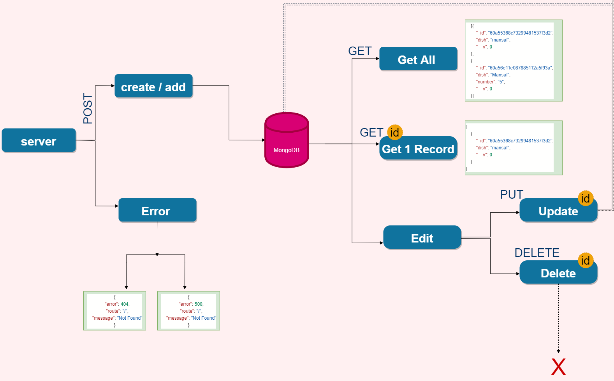

# api-server

## [Check the deployed app](https://basic-api-server-wafa.herokuapp.com/)


## End points : 

- [Food](https://api-server-wafa.herokuapp.com/api/v1/food)
- [Clothes](https://api-server-wafa.herokuapp.com/api/v1/food)


Building a REST API using Express, by creating a proper series of endpoints that perform CRUD operations on a Mongo Database, using the REST standard

***

## Methods:

CRUD Operation: Create

REST Method: POST

Path: - api/v1/food

      - api/v1/clothes

Input: JSON Object in the Request Body

Returns: The record that was added to the database

***

CRUD Operation: Read

REST Method: GET

Path: - api/v1/food

      - api/v1/clothes

Returns: An array of objects, each object being one entry from your database

***

CRUD Operation: Read

REST Method: GET

Path: - api/v1/food/ID

      - api/v1/clothes/ID

Returns: The object from the database, which has the id matching that which is in the path

***

CRUD Operation: Update

REST Method: PUT

Path: - api/v1/food/ID

      - api/v1/clothes/ID

Input: JSON Object in the Request Body

Returns: The object from the database, which has the id matching that which is in the path, with the updated/changed data

***

CRUD Operation: Destroy

REST Method: DELETE

Path: - api/v1/food/ID

      - api/v1/clothes/ID
      
Returns: The record from the database as it exists

***

## structure

```
├── .gitignore
├── .eslintrc.json
├── __tests__
│   ├── server.test.js
│   ├── food.test.js
│   ├── clothes.test.js
├── src
│   ├── error-handlers
│   │   ├── 404.js
│   │   ├── 500.js
│   ├── middleware
│   │   ├── logger.js
│   │   ├── validator.js
│   ├── models
│   │   ├── data-collection-class.js
│   │   ├── food.js
│   │   ├── clothes.js
│   ├── routes
│   │   ├── food.js
│   │   ├── clothes.js
│   ├── server.js
├── index.js
└── package.json
```


## Implementation Notes

Created 2 in-memory data models using ES6 Classes, and exported as Node Modules.

***

## Testing:

food.js & clothes.js Checks The correct status codes and returned data for each REST route

server.js Checks the bad methods and bad routes


## [Actions](https://github.com/wafaankoush99/api-server/actions)

## [Pull request](https://github.com/wafaankoush99/api-server/pull/1)

***

## Dependencies 

- express
-  dotenv
-  jest
-  cors
-  morgan
-  @code-fellows/supergoose

***

## UML


